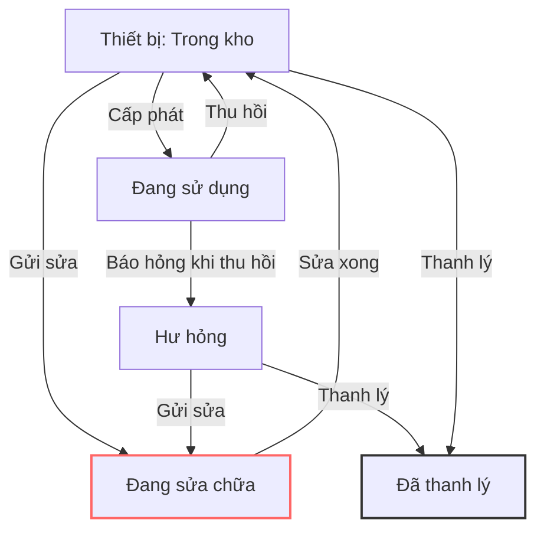
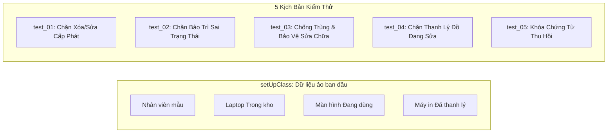

# 📘 BÁO CÁO TỔNG KẾT GIAI ĐOẠN 1: KHÓA VÒNG ĐỜI & TOÀN VẸN DỮ LIỆU BACKEND (P0)

> **Module**: `equipment_management` (Odoo 19.0)  
> **Mục tiêu**: Lắp đặt các "chốt khóa bảo vệ" ở tầng Backend (Python) để đảm bảo dữ liệu không bao giờ bị sai lệch, không thể bị sửa/xóa lậu qua API, Excel Import hay gọi code ngầm.

---

## 🎯 1. Những Gì Đã Làm Được Trong Giai Đoạn 1

Trong giai đoạn này, chúng ta đã can thiệp vào **4 model nghiệp vụ chính** và **1 model thiết bị cốt lõi**, giải quyết triệt để tất cả các lỗ hổng logic nghiêm trọng (P0):



---

### 1.1. Khóa Chặt Model Phiếu Bảo Trì (`equipment_maintenance.py`)

* **Lỗ hổng cũ**: 
  - Cho phép đem thiết bị *đã bán thanh lý* hoặc *đang giao cho nhân viên* đi bảo trì.
  - Cho phép tạo 2-3 phiếu sửa chữa cùng lúc cho 1 chiếc máy tính.
  - **Lỗi "hồi sinh" thiết bị ma**: Nếu máy tính đã bị thanh lý mà phiếu bảo trì cũ bấm "Hoàn thành", máy tính tự động bị biến thành `available` (sống lại trong kho).
* **Giải pháp & Ví dụ minh họa**:
  - 🛑 **Ví dụ 1 (Chặn bảo trì đồ đang dùng)**: Nhân viên A đang giữ Laptop `EQ/001`. Quản trị viên cố tình tạo phiếu bảo trì cho `EQ/001` và bấm *Xác nhận*.  
    👉 **Hệ thống báo lỗi**: *"Thiết bị 'EQ/001' đang được giao cho nhân viên sử dụng. Vui lòng tạo phiếu thu hồi trước khi gửi bảo trì."*
  - 🛑 **Ví dụ 2 (Chống trùng phiếu)**: Laptop `EQ/002` đang có phiếu `MT/001` ở trạng thái "Đang bảo trì". Người khác tạo tiếp phiếu `MT/002` cho máy này.  
    👉 **Hệ thống chặn ngay từ lúc lưu**: *"Thiết bị 'EQ/002' đang có phiếu bảo trì 'MT/001' đang xử lý."*
  - 🛑 **Ví dụ 3 (Chặn xóa/sửa lén)**: Phiếu bảo trì đang sửa chữa hoặc đã xong thì cấm bấm Xóa (`unlink`) hoặc sửa đổi giá tiền/ngày tháng (`write`).

---

### 1.2. Khóa Chặt Model Phiếu Thanh Lý (`equipment_liquidation.py`)

* **Lỗ hổng cũ**: 
  - Thiết bị đang nằm ở tiệm sửa chữa ngoài phố vẫn bị bấm thanh lý bán cho người khác.
  - Phiếu thanh lý đã duyệt bán xong vẫn bị nhân viên vào sửa lại giá tiền hoặc xóa mất tích.
* **Giải pháp & Ví dụ minh họa**:
  - 🛑 **Ví dụ 1 (Chặn bán đồ đang sửa)**: Máy in `EQ/003` đang ở tiệm bảo trì. Thủ kho tạo phiếu thanh lý cho `EQ/003`.  
    👉 **Hệ thống chặn**: *"Thiết bị 'EQ/003' hiện đang có phiếu bảo trì đang xử lý. Vui lòng hoàn thành hoặc hủy bảo trì trước khi thanh lý."*
  - 🛑 **Ví dụ 2 (Bảo vệ chứng từ kế toán)**: Phiếu thanh lý `LQ/001` đã được Giám đốc bấm "Đã duyệt" (`approved`). Nếu ai đó cố tình gọi API xóa phiếu hoặc đổi số tiền thu hồi.  
    👉 **Hệ thống ném lỗi**: *"Không thể xóa phiếu thanh lý đã duyệt (LQ/001)"* hoặc *"Không thể chỉnh sửa thông tin thanh lý khi phiếu đã duyệt."*

---

### 1.3. Khóa Chặt Model Phiếu Cấp Phát (`allocation.py`)

* **Lỗ hổng cũ**: 
  - Không có hàm chặn xóa. Ai đó xóa nhầm phiếu cấp phát đã xác nhận ➡️ Thiết bị bị kẹt ở trạng thái `assigned` vĩnh viễn và không bao giờ tạo được phiếu thu hồi.
* **Giải pháp & Ví dụ minh họa**:
  - 🛑 **Ví dụ**: Phiếu cấp phát `AL/001` đã bàn giao Laptop cho nhân viên. Nhân sự vào menu chọn phiếu và bấm **Xóa**.  
    👉 **Hệ thống chặn ngay lập tức**: *"Không thể xóa phiếu cấp phát đã xác nhận (AL/001). Chứng từ này cần được lưu giữ để theo dõi lịch sử tài sản."*

---

### 1.4. Khóa Chặt Model Phiếu Thu Hồi (`equipment_return.py`)

* **Giải pháp**: Khóa phương thức `write()` — Một khi phiếu thu hồi đã xác nhận hoàn tất (`returned`), nghiêm cấm chỉnh sửa tình trạng thu hồi hoặc đổi phiếu cấp phát gốc.

---

### 1.5. Chuẩn Hóa Cảnh Báo Odoo 19 (`equipment.py` & `__manifest__.py`)

* **Vấn đề**: Odoo 19 cảnh báo `UserWarning` khi gộp chung hàm tính toán cho trường `store=True` (lưu DB) và `store=False` (tính thời gian thực).
* **Giải pháp**:
  - Tách thành 2 hàm tính toán riêng biệt:
    1. `_compute_annual_depreciation`: Tính mức khấu hao và tỷ lệ/năm (`store=True`, `compute_sudo=True`).
    2. `_compute_accumulated_depreciation`: Tính khấu hao lũy kế và giá trị còn lại theo thời gian thực.
  - Bổ sung `author: "ShibaDeku"` vào Manifest.
  - 👉 **Kết quả**: Log Odoo sạch hoàn toàn, không còn bất kỳ warning nào.

---

## 🤖 2. Chi Tiết File Test Tự Động (`tests/test_phase1_guards.py`)

### ❓ File test là gì và tại sao cần có nó?
File test là một **kịch bản kiểm thử tự động (Unit Test)**. Nó hoạt động như một "Robot QA" tự động mô phỏng các hành vi cố tình làm sai của người dùng để xác nhận Backend có chặn đúng hay không.

> **Đặc điểm quan trọng**: Bộ test kế thừa từ `TransactionCase` của Odoo. Toàn bộ dữ liệu sinh ra khi test đều nằm trong một Transaction tạm thời và **tự động Rollback (hủy bỏ) 100%** ngay sau khi test xong ➡️ **Tuyệt đối không để lại rác trong Database**.

---

### 📋 Nội dung 5 bài test tự động bên trong file:



#### Chi tiết từng hàm Test:

1. **`test_01_allocation_guards` (Kiểm tra bảo vệ phiếu cấp phát)**:
   - *Hành động*: Tạo phiếu cấp phát Laptop cho nhân viên ➡️ Bấm xác nhận (`action_confirm`).
   - *Thử thách 1*: Cố tình gọi `alloc.unlink()` (Xóa phiếu).  
     ➡️ **Kỳ vọng**: Bắt buộc phải ném lỗi `UserError`.
   - *Thử thách 2*: Cố tình gọi `alloc.write({'employee_id': ...})` (Đổi người nhận).  
     ➡️ **Kỳ vọng**: Bắt buộc phải ném lỗi `UserError`.

2. **`test_02_maintenance_input_validation` (Kiểm tra đầu vào bảo trì)**:
   - *Thử thách 1*: Tạo phiếu bảo trì cho thiết bị đang `assigned` và bấm xác nhận.  
     ➡️ **Kỳ vọng**: Phải ném lỗi `UserError` yêu cầu thu hồi trước.
   - *Thử thách 2*: Tạo phiếu bảo trì cho thiết bị đã `liquidated`.  
     ➡️ **Kỳ vọng**: Phải ném lỗi `ValidationError` không cho lưu.

3. **`test_03_maintenance_concurrency_and_guards` (Kiểm tra chống trùng lặp & bảo vệ sửa chữa)**:
   - *Hành động*: Đưa Laptop vào trạng thái đang sửa chữa (`in_progress`).
   - *Thử thách 1*: Cố tình tạo tiếp phiếu sửa chữa thứ 2 cho cùng Laptop đó.  
     ➡️ **Kỳ vọng**: Phải ném lỗi `ValidationError` chặn tạo trùng.
   - *Thử thách 2*: Thử xóa hoặc sửa chi phí phiếu bảo trì khi đang sửa.  
     ➡️ **Kỳ vọng**: Phải ném lỗi `UserError`.
   - *Hành động kết thúc*: Bấm hoàn thành bảo trì (`action_done`).  
     ➡️ **Kỳ vọng**: Trạng thái thiết bị phải quay về `available` (Trong kho) an toàn.

4. **`test_04_liquidation_guards_and_maint_check` (Kiểm tra thanh lý)**:
   - *Thử thách 1*: Đưa thiết bị vào bảo trì ➡️ Thử tạo phiếu thanh lý cho thiết bị đó.  
     ➡️ **Kỳ vọng**: Phải ném lỗi `ValidationError` chặn thanh lý đồ đang sửa.
   - *Thử thách 2*: Hủy bảo trì ➡️ Duyệt thanh lý hợp lệ (`action_approve`).
   - *Thử thách 3*: Thử xóa phiếu thanh lý đã duyệt hoặc sửa giá bán.  
     ➡️ **Kỳ vọng**: Phải ném lỗi `UserError`.

5. **`test_05_return_guards` (Kiểm tra phiếu thu hồi)**:
   - *Hành động*: Cấp phát thiết bị rồi thực hiện thu hồi về kho (`action_confirm`).
   - *Kiểm tra*: Thiết bị về `available`, phiếu cấp phát gốc thành `returned`, phiếu thu hồi thành `returned`.
   - *Thử thách*: Cố tình gọi `unlink()` hoặc `write()` trên phiếu thu hồi.  
     ➡️ **Kỳ vọng**: Phải ném lỗi `UserError`.

---

## 🚀 3. Hướng Dẫn Chạy Test & Đọc Kết Quả

### Câu lệnh chạy test:
Mở Terminal tại thư mục gốc Odoo (`d:\odoo_19.0.20260720.tar\odoo-19.0.post20260720`):

```powershell
.\.venv\Scripts\python.exe odoo-bin -c odoo.conf -d odoo19 -u equipment_management --test-tags=equipment_phase1 --stop-after-init
```

### Cách đọc kết quả thành công:

```text
INFO odoo19 odoo.addons.equipment_management.tests.test_phase1_guards: Starting TestEquipmentPhase1Guards.test_01_allocation_guards ...
INFO odoo19 odoo.addons.equipment_management.tests.test_phase1_guards: Starting TestEquipmentPhase1Guards.test_02_maintenance_input_validation ...
INFO odoo19 odoo.addons.equipment_management.tests.test_phase1_guards: Starting TestEquipmentPhase1Guards.test_03_maintenance_concurrency_and_guards ...
INFO odoo19 odoo.addons.equipment_management.tests.test_phase1_guards: Starting TestEquipmentPhase1Guards.test_04_liquidation_guards_and_maint_check ...
INFO odoo19 odoo.addons.equipment_management.tests.test_phase1_guards: Starting TestEquipmentPhase1Guards.test_05_return_guards ...
INFO odoo19 odoo.service.server: 5 post-tests in 0.45s, 286 queries
INFO odoo19 odoo.tests.result: 0 failed, 0 error(s) of 5 tests when loading database 'odoo19'
```

* **`5 post-tests in 0.45s`**: Cả 5 kịch bản kiểm thử chạy xong chỉ trong 0.45 giây.
* **`0 failed, 0 error(s)`**: Không có bất kỳ lỗi nào, toàn bộ chốt khóa bảo vệ backend hoạt động hoàn hảo 100%.

---

## 📌 Tóm Tắt Giá Trị Đạt Được Sau Giai Đoạn 1

| Tiêu chí | Trước Giai đoạn 1 | Sau Giai đoạn 1 |
| :--- | :--- | :--- |
| **Bảo vệ dữ liệu** | Chỉ chặn trên nút bấm UI (dễ bị lách qua API) | Khóa chặt 100% ở tầng Backend Python |
| **Xung đột nghiệp vụ** | Đồ đang sửa vẫn bị bán, đồ đã bán vẫn đem đi sửa | Vòng đời khép kín, chống xung đột tuyệt đối |
| **Chứng từ kiểm toán** | Có thể xóa mất phiếu cấp phát / thanh lý | Cấm xóa chứng từ đã duyệt để bảo vệ lịch sử |
| **Kiểm thử** | Phải click chuột bằng tay từng bước | Có bộ Unit Test tự động chạy trong 0.45s |
| **Chất lượng code Odoo 19** | Có warning về store / compute / author | **Clean 100% không còn bất kỳ warning nào** |
