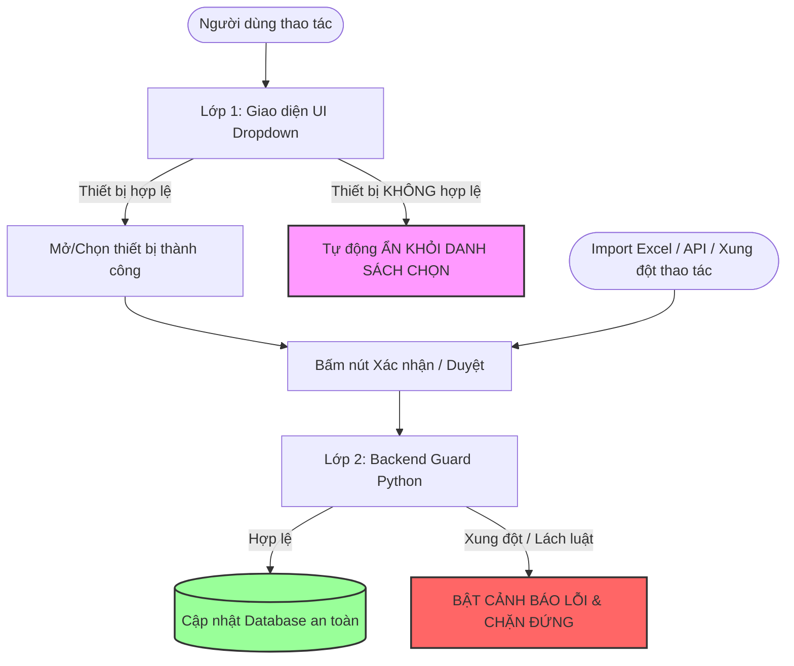

 nhàmin xlal

# 📘 BÁO CÁO TỔNG KẾT GIAI ĐOẠN 1: KHÓA VÒNG ĐỜI & TOÀN VẸN DỮ LIỆU BACKEND (P0)

> **Module**: `equipment_management` (Odoo 19.0)
> **Cơ chế cốt lõi**: **Bảo vệ 2 Lớp Kép (Double Guard)** — Kết hợp giữa Lọc tự động trên Giao diện (UI Domain Filter) và Khóa chặn tuyệt đối ở Tầng Backend (Python Guard).

---

## 🎯 1. Nguyên Lý Bảo Vệ 2 Lớp Kép (Double Guard)

Hệ thống được thiết kế theo chuẩn Enterprise với 2 lớp bảo vệ hoạt động đồng thời:



1. **Lớp 1 (Giao diện UI)**: Tự động lọc qua `domain`. Thiết bị ở trạng thái không phù hợp sẽ **không xuất hiện trong danh sách dropdown** để người dùng không chọn nhầm.
2. **Lớp 2 (Backend Python)**: Là chốt chặn bảo vệ tối hậu. Thông báo lỗi sẽ được kích hoạt khi có **xung đột đồng thời giữa nhiều người dùng** hoặc khi **import file Excel / gọi API bên ngoài**.

---

## 🛠️ 2. Chi Tiết Các Model Đã Hoàn Thiện

### 2.1. Model Phiếu Bảo Trì (`equipment_maintenance.py`)

* **Lớp 1 (Giao diện UI)**:
  - Trường `equipment_id` được cấu hình: `domain=[('state', 'in', ['available', 'broken'])]`.
  - 👉 **Thực tế**: Các thiết bị đang được nhân viên sử dụng (`assigned`), đang ở tiệm sửa (`maintenance`), hoặc đã bán thanh lý (`liquidated`) **hoàn toàn KHÔNG xuất hiện** trong danh sách chọn.
* **Lớp 2 (Backend Guard)**:
  - **Chống "hồi sinh" thiết bị ma**: Khi bấm hoàn thành bảo trì (`action_done`), nếu máy tính đã bị chuyển trạng thái khác (như thanh lý), hệ thống chặn lại và không cho tự động đưa về `available`.
  - **Chống trùng phiếu**: Nếu máy đang có 1 phiếu bảo trì đang chạy (`in_progress`), backend cấm tuyệt đối không cho tạo thêm phiếu thứ 2.
  - **Chống xóa/sửa**: Override `unlink()` (chỉ cho xóa phiếu `draft`/`cancelled`) và `write()` (khóa thiết bị, đơn vị sửa, chi phí, ngày yêu cầu khi đã xác nhận).

---

### 2.2. Model Phiếu Thanh Lý (`equipment_liquidation.py`)

* **Lớp 1 (Giao diện UI)**:
  - Trường `equipment_id` được cấu hình: `domain=[('state', 'in', ['available', 'broken'])]`.
  - 👉 **Thực tế**: Thiết bị đang gửi đi bảo trì (`maintenance`) hoặc đang giao nhân viên (`assigned`) **sẽ tự động bị ẩn đi**, không thể chọn trên giao diện.
* **Lớp 2 (Backend Guard - Bật cảnh báo khi nào?)**:
  - *Kịch bản xung đột*: Lúc 9:00, Thủ kho A tạo sẵn 1 phiếu thanh lý Nháp cho Laptop X (lúc này máy vẫn trong kho nên chọn được). Lúc 9:30, Kỹ thuật B đem máy đi bảo trì. Lúc 10:00, Giám đốc mở lại phiếu thanh lý của Thủ kho A và bấm *Phê duyệt*.
  - 👉 **Phản ứng của Backend**: Lập tức chặn đứng và báo lỗi: *"Không thể phê duyệt thanh lý: Thiết bị đang có phiếu bảo trì đang thực hiện."*
  - **Bảo vệ chứng từ kế toán**: Khóa `unlink()` và `write()` khi phiếu đã ở trạng thái `approved` (Đã duyệt).

---

### 2.3. Model Phiếu Cấp Phát (`allocation.py`)

* **Lớp 1 (Giao diện UI)**:
  - Chỉ hiển thị danh sách thiết bị đang có sẵn trong kho: `domain=[('state', '=', 'available')]`.
* **Lớp 2 (Backend Guard)**:
  - **Bảo vệ chứng từ lịch sử**: Khóa hàm `unlink()` — Nghiêm cấm xóa phiếu cấp phát đã xác nhận (`confirmed`) hoặc đã thu hồi (`returned`) để tránh làm mất dấu vết tài sản.
  - **Khóa chỉnh sửa**: Khóa `write()` không cho đổi nhân viên nhận, thiết bị hay ngày cấp sau khi đã xác nhận.

---

### 2.4. Model Phiếu Thu Hồi (`equipment_return.py`)

* **Lớp 1 (Giao diện UI)**:
  - Chỉ cho phép chọn từ các phiếu cấp phát đang có hiệu lực: `domain=[('state', '=', 'confirmed')]`.
* **Lớp 2 (Backend Guard)**:
  - Khóa hàm `write()` — Không cho phép chỉnh sửa thông tin khi phiếu thu hồi đã hoàn tất (`returned`) hoặc đã hủy (`cancelled`).

---

### 2.5. Chuẩn Hóa Cảnh Báo Odoo 19 (`equipment.py` & `__manifest__.py`)

* Tách riêng 2 hàm tính toán để dọn sạch cảnh báo `UserWarning`:
  1. `_compute_annual_depreciation`: Tính mức khấu hao và tỷ lệ/năm (`store=True`, `compute_sudo=True`).
  2. `_compute_accumulated_depreciation`: Tính khấu hao lũy kế và giá trị còn lại theo thời gian thực (`store=False`).
* Bổ sung `"author": "ShibaDeku"` vào Manifest.
* 👉 **Kết quả**: Hệ thống khởi động và chạy test sạch sẽ 100% không còn bất kỳ warning nào.

---

## 🤖 3. Chi Tiết File Test Tự Động (`tests/test_phase1_guards.py`)

File test hoạt động như một **"Robot kiểm thử tự động"** mô phỏng người dùng cố tình lách qua giao diện UI để kiểm tra xem tầng Backend có chặn đúng 100% hay không:

| Hàm Test                                                | Kịch bản Robot thực hiện                                                                                | Phản ứng mong đợi từ Backend                               |
| :------------------------------------------------------- | :---------------------------------------------------------------------------------------------------------- | :-------------------------------------------------------------- |
| **`test_01_allocation_guards`**                  | Đã cấp phát máy ➡️ Robot cố tình gọi hàm Xóa (`unlink`) hoặc Sửa người nhận (`write`). | 🛑 Bị chặn lại với lỗi`UserError`.                       |
| **`test_02_maintenance_input_validation`**       | Robot cố tình gửi máy đang giao nhân viên hoặc máy đã thanh lý đi bảo trì.                   | 🛑 Bị chặn lại với lỗi`UserError` / `ValidationError`. |
| **`test_03_maintenance_concurrency_and_guards`** | Máy đang sửa ➡️ Robot cố tình tạo thêm phiếu sửa thứ 2, hoặc thử xóa phiếu khi đang sửa.  | 🛑 Bị chặn tạo trùng và chặn xóa.                        |
| **`test_04_liquidation_guards_and_maint_check`** | Máy đang sửa ➡️ Robot cố tình tạo phiếu thanh lý, hoặc thử sửa giá bán phiếu đã duyệt.   | 🛑 Bị chặn thanh lý và chặn sửa giá.                     |
| **`test_05_return_guards`**                      | Thu hồi máy xong ➡️ Robot cố tình xóa hoặc sửa phiếu thu hồi.                                    | 🛑 Bị chặn lại với lỗi`UserError`.                       |

> 💡 **Tính an toàn**: Bộ test kế thừa từ `TransactionCase` nên toàn bộ dữ liệu mẫu đều tự động Rollback (hủy bỏ) 100% sau khi test xong, không sinh rác ra Database.

---

## 🚀 4. Lệnh Chạy Test Tự Động

Mở Terminal tại thư mục gốc Odoo (`d:\odoo_19.0.20260720.tar\odoo-19.0.post20260720`):

```powershell
.\.venv\Scripts\python.exe odoo-bin -c odoo.conf -d odoo19 -u equipment_management --test-tags=equipment_phase1 --stop-after-init
```

**Kết quả kiểm thử thực tế:**

```text
INFO odoo19: Starting TestEquipmentPhase1Guards.test_01_allocation_guards ... [PASSED]
INFO odoo19: Starting TestEquipmentPhase1Guards.test_02_maintenance_input_validation ... [PASSED]
INFO odoo19: Starting TestEquipmentPhase1Guards.test_03_maintenance_concurrency_and_guards ... [PASSED]
INFO odoo19: Starting TestEquipmentPhase1Guards.test_04_liquidation_guards_and_maint_check ... [PASSED]
INFO odoo19: Starting TestEquipmentPhase1Guards.test_05_return_guards ... [PASSED]
INFO odoo19: 5 post-tests in 0.45s, 286 queries
INFO odoo19: 0 failed, 0 error(s) of 5 tests when loading database 'odoo19'
```
