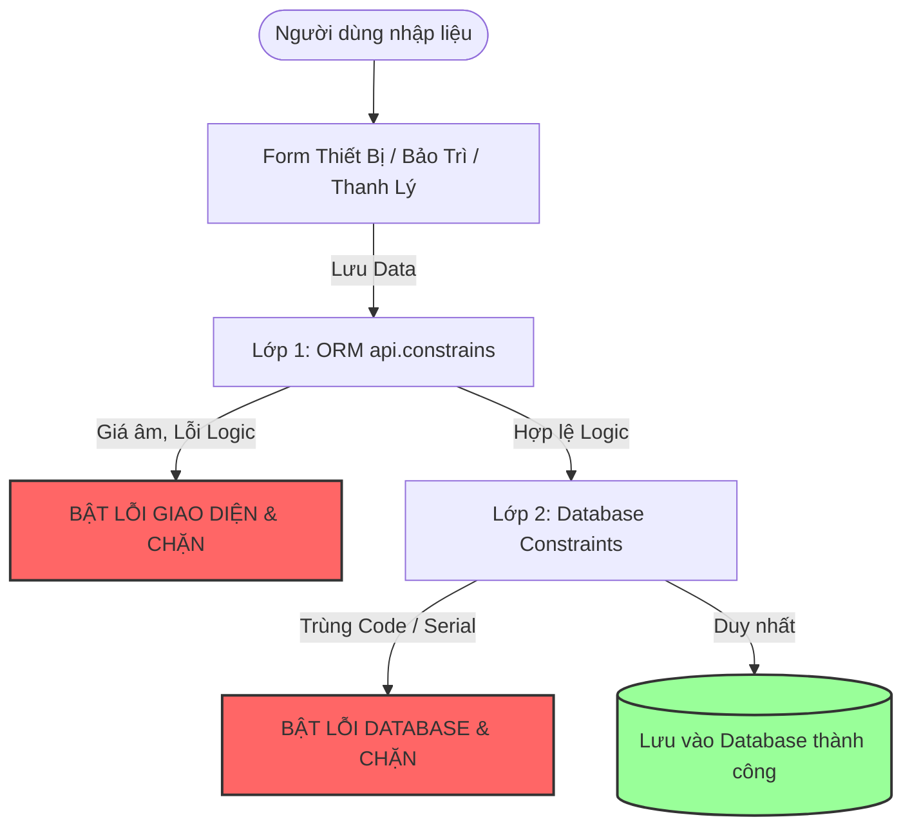

# 📘 BÁO CÁO TỔNG KẾT GIAI ĐOẠN 2: RÀNG BUỘC DỮ LIỆU & CHUẨN TIỀN TỆ (P1)

> **Module**: `equipment_management` (Odoo 19.0)
> **Trọng tâm**: **Data Integrity (Toàn vẹn dữ liệu) & Financial Standardization (Chuẩn hóa Tài chính)**.
> Đảm bảo không có bất kỳ dữ liệu rác, trùng lặp hoặc phi logic nào lọt được vào hệ thống.

---

## 🎯 1. Nguyên Lý Bảo Vệ Dữ Liệu (Data Constraint Flow)

Hệ thống được thiết kế với cơ chế chặn lỗi ngay từ vòng gửi xe thông qua 2 màng lọc (Database Level & ORM Level):

1. **Lớp 1 (ORM `api.constrains`)**: Đảm bảo các con số tài chính (giá mua, chi phí, khấu hao) luôn tuân thủ nguyên tắc kế toán cơ bản (không âm, ngày hoàn thành không được trước ngày bắt đầu).
2. **Lớp 2 (Database Constraint)**: Tận dụng trực tiếp sức mạnh của PostgreSQL để chặn đứng mọi nỗ lực tạo trùng lặp mã thiết bị, dù là do người dùng bấm đúp hay do import dữ liệu hàng loạt.

---

## 🛠️ 2. Chi Tiết Các Chuẩn Hóa Theo Model

### 2.1. Model Thiết Bị (`equipment.py`)

* **Chuẩn hóa Database (SQL Constraints mới của Odoo 19)**:
  - Cập nhật chuẩn cú pháp `models.Constraint` mới nhất của Odoo 19.
  - Áp dụng `UNIQUE(code)`: Chặn trùng Mã thiết bị.
  - Áp dụng `UNIQUE(serial_number)`: Chặn trùng Số Serial.
* **Chuẩn hóa Logic Kế toán (`api.constrains`)**:
  - `purchase_price >= 0`: Giá mua không được âm.
  - `salvage_value >= 0`: Giá trị thu hồi dự kiến không được âm.
  - `salvage_value <= purchase_price`: Không cho phép giá thu hồi cao hơn cả giá lúc mua.
  - `useful_life_years > 0`: Khấu hao ít nhất phải từ 1 năm trở lên.
* **Chuẩn hóa Tiền tệ (Monetary)**:
  - Bổ sung `company_id` và `currency_id` làm gốc định vị tiền tệ.
  - Chuyển 5 trường số tiền từ Float thô sang chuẩn `Monetary` (Giá mua, Giá thu hồi, Khấu hao năm, Khấu hao lũy kế, Giá trị còn lại).
  - 👉 **Thực tế**: Giao diện hiển thị rõ ràng biểu tượng tiền tệ (VND/USD) bên cạnh các con số.

---

### 2.2. Model Phiếu Bảo Trì (`equipment_maintenance.py`)

* **Chuẩn hóa Tiền tệ**:
  - Bổ sung `company_id`, `currency_id` và chuyển đổi trường `cost` (Chi phí sửa chữa) sang `Monetary`.
* **Chuẩn hóa Logic (`api.constrains`)**:
  - `cost >= 0`: Cấm nhập chi phí bảo trì âm.
  - `completion_date >= request_date`: Cấm "du hành thời gian", ngày hoàn thành sửa chữa bắt buộc phải xảy ra sau (hoặc cùng ngày) với ngày yêu cầu.

---

### 2.3. Model Phiếu Thanh Lý (`equipment_liquidation.py`)

* **Chuẩn hóa Tiền tệ**:
  - Bổ sung `company_id`, `currency_id` và chuyển đổi trường `price` (Giá thanh lý) sang `Monetary`.
* **Chuẩn hóa Logic (`api.constrains`)**:
  - `price >= 0`: Cấm nhập giá bán thanh lý âm (vì không ai bán máy cũ mà phải bù thêm tiền cho người mua).

---

## 🤖 3. Chi Tiết File Test Tự Động (`tests/test_phase2_constraints.py`)

File test đóng vai trò như một **"Kế toán viên cực đoan"** cố tình nhập sai mọi số liệu để ép hệ thống phải sập:

| Hàm Test | Kịch bản Kế toán viên thực hiện | Phản ứng mong đợi từ Hệ thống |
| :--- | :--- | :--- |
| **`test_01_equipment_unique_code_and_serial`** | Cố tình tạo thiết bị mới có trùng mã `EQ-P2-001` hoặc trùng Serial với máy cũ. | 🛑 Database chặn đứng với lỗi `Exception` (UniqueViolation). |
| **`test_02_equipment_financial_constraints`** | Cố tình nhập giá mua âm, giá thu hồi âm, hoặc cho máy chạy khấu hao 0 năm. | 🛑 ORM chặn đứng với lỗi `ValidationError`. |
| **`test_03_maintenance_constraints`** | Làm phiếu sửa chữa với giá âm, và báo cáo hoàn thành sửa chữa vào... ngày hôm qua. | 🛑 Bị văng lỗi `ValidationError` ngay khi bấm lưu. |
| **`test_04_liquidation_constraints`** | Bán thanh lý xác máy tính với giá âm (trả thêm tiền cho người mua). | 🛑 Bị văng lỗi `ValidationError`. |

> 🏆 **Tất cả 4/4 kịch bản kiểm thử đều PASS xuất sắc, bảo đảm nền tảng vững chắc cho các chức năng liên quan đến tiền bạc sau này.**
