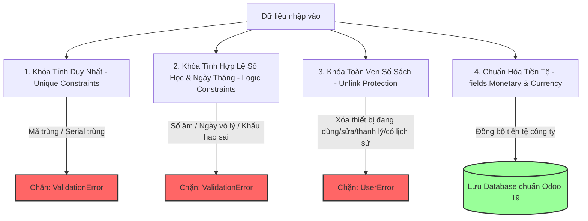

# 📘 BÁO CÁO TỔNG KẾT GIAI ĐOẠN 2: RÀNG BUỘC DỮ LIỆU & CHUẨN TIỀN TỆ (P1)

> **Module**: `equipment_management` (Odoo 19.0)
> **Nhánh thực hiện**: `feature/phase2-data-constraints`
> **Mục tiêu cốt lõi**: Đảm bảo **tính toàn vẹn dữ liệu** (Data Integrity), **chuẩn hóa tiền tệ đa công ty** (Multi-Company Currency Standard) và **chống xóa thiết bị bất hợp lệ** (Equipment Deletion Protection).

---

## 🎯 1. Kiến Trúc Ràng Buộc Dữ Liệu & Chuẩn Hóa

Hệ thống được chuẩn hóa toàn diện từ tầng Database, Business Logic Python đến giao diện UI:



---

## 🛠️ 2. Chi Tiết Các Model Đã Chuẩn Hóa

### 2.1. Model Thiết Bị Gốc (`models/equipment.py`)

* **Ràng buộc Tính Duy Nhất (Unique Constraints)**:
  - **Tên thiết bị (`name`)**: Cho phép trùng lặp bình thường (đáp ứng nghiệp vụ mua nhiều thiết bị cùng model/chủng loại, ví dụ: 10 máy *Laptop Dell Latitude 3420*).
  - **Mã thiết bị (`code`)**: Khóa 2 lớp bằng `_sql_constraints = [('unique_code', 'unique(code)', ...)]` ở cấp Database Postgres và `@api.constrains('code')` ở cấp Python với thông báo tiếng Việt trực quan: *"Mã thiết bị '...' đã tồn tại trong hệ thống. Vui lòng sử dụng mã khác."*
  - **Số Serial (`serial_number`)**: Áp dụng `@api.constrains('serial_number')` kiểm tra tự động, không cho phép 2 thiết bị khác nhau sử dụng cùng 1 số Serial (nếu có nhập).
* **Ràng buộc Số học & Khấu hao (`@api.constrains`)**:
  - Giá mua không được âm: `purchase_price >= 0`.
  - Giá trị thu hồi không được âm và không được vượt quá giá mua ban đầu: `0 <= salvage_value <= purchase_price`.
  - Thời gian sử dụng/khấu hao phải là số dương: `useful_life_years > 0`.
* **Khóa Hàm Xóa Thiết Bị (`unlink`)**:
  - Nghiêm cấm xóa thiết bị khi thiết bị đang ở các trạng thái: Đang sử dụng (`assigned`), Đang sửa chữa (`maintenance`), Đã thanh lý (`liquidated`).
  - Nghiêm cấm xóa thiết bị nếu đã có **lịch sử phiếu bảo trì** hoặc **phiếu thanh lý** liên kết để bảo toàn sổ sách tài sản công ty.
  - Chỉ cho phép xóa thiết bị mới tạo nháp/trong kho chưa phát sinh giao dịch.
* **Chuẩn Hóa Tiền Tệ (Odoo 19 Currency Standard & Auto VND)**:
  - Bổ sung `company_id` (mặc định lấy theo công ty đang làm việc của người dùng).
  - Tự động kích hoạt và đặt mặc định tiền tệ là **`VND (₫)`** cho toàn bộ thiết bị mới và cũ (`init()` auto-migration).
  - Mở trường chọn Tiền tệ linh hoạt: Người dùng có thể tự do bấm dropdown đổi sang `USD`, `EUR`, `JPY`... cho từng thiết bị nếu cần.
  - Chuyển đổi toàn bộ 5 trường tiền từ `Float` sang `fields.Monetary`: `purchase_price`, `salvage_value`, `annual_depreciation`, `accumulated_depreciation`, `remaining_value`.

---

### 2.2. Model Phiếu Bảo Trì (`models/equipment_maintenance.py`)

* **Chuẩn Hóa Tiền Tệ**: Bổ sung `company_id`, `currency_id` (mặc định VND), chuyển `cost` từ `Float` sang `fields.Monetary(currency_field='currency_id')`.
* **Ràng buộc Tính Hợp Lệ (`@api.constrains`)**:
  - Chi phí sửa chữa không được âm: `cost >= 0`.
  - Ngày hoàn thành không thể xảy ra trước ngày gửi yêu cầu: `completion_date >= request_date`.

---

### 2.3. Model Phiếu Thanh Lý (`models/equipment_liquidation.py`)

* **Chuẩn Hóa Tiền Tệ**: Bổ sung `company_id`, `currency_id` (mặc định VND), chuyển `price` từ `Float` sang `fields.Monetary(currency_field='currency_id')`.
* **Ràng buộc Tính Hợp Lệ (`@api.constrains`)**:
  - Giá thanh lý / Số tiền thu hồi không được âm: `price >= 0`.

---

### 2.4. Model Cấp Phát & Thu Hồi (`allocation.py` & `equipment_return.py`)

* Bổ sung trường `company_id` chuẩn hóa đa công ty đồng bộ trên toàn bộ 5 model của addon `equipment_management`.

---

### 2.5. Giao Diện XML Views Chuẩn Odoo 19 (`views/`)

* **Ẩn sạch cột phụ trợ ở List View**: Áp dụng `<field name="currency_id" column_invisible="1"/>` trên các `<list>` view ([equipment_views.xml](file:///d:/odoo_19.0.20260720.tar/odoo-19.0.post20260720/custom_addons/equipment_management/views/equipment_views.xml), [maintenance_views.xml](file:///d:/odoo_19.0.20260720.tar/odoo-19.0.post20260720/custom_addons/equipment_management/views/maintenance_views.xml), [liquidation_views.xml](file:///d:/odoo_19.0.20260720.tar/odoo-19.0.post20260720/custom_addons/equipment_management/views/liquidation_views.xml)) để không bị thừa cột trống ở đầu bảng.
* **Bổ sung cột Giá mua (`purchase_price`) trên List View**: Hiển thị số tiền kèm ký hiệu tiền tệ rõ ràng (ví dụ: `25.000.000 ₫`).
* **Hiển thị ô chọn Tiền tệ trên Form View**: Đặt cạnh các ô Giá mua, Chi phí bảo trì, Giá thanh lý để người dùng tiện theo dõi và tùy chọn.

---

## 🤖 3. Chi Tiết File Test Tự Động (`tests/test_phase2_constraints.py`)

Bộ kiểm thử tự động mô phỏng các hành vi cố tình nhập sai dữ liệu hoặc phá vỡ cấu trúc sổ sách:

| Hàm Test | Kịch bản Robot thực hiện | Phản ứng mong đợi từ Backend |
| :--- | :--- | :--- |
| **`test_01_unique_code_and_serial`** | Robot cố tình tạo thiết bị trùng Mã (`code`) hoặc trùng Số Serial (`serial_number`). | 🛑 Bị chặn lại với lỗi `ValidationError`. |
| **`test_02_equipment_value_constraints`** | Robot thử nhập giá mua âm, giá thu hồi âm, giá thu hồi > giá mua, hoặc khấu hao 0 năm. | 🛑 Bị chặn lại với lỗi `ValidationError`. |
| **`test_03_maintenance_constraints`** | Robot thử nhập chi phí bảo trì âm, hoặc ngày hoàn thành trước ngày gửi yêu cầu. | 🛑 Bị chặn lại với lỗi `ValidationError`. |
| **`test_04_liquidation_constraints`** | Robot thử nhập giá thanh lý âm. | 🛑 Bị chặn lại với lỗi `ValidationError`. |
| **`test_05_equipment_unlink_protection`** | Robot thử xóa thiết bị đang dùng (`assigned`), đang sửa (`maintenance`), đã thanh lý (`liquidated`), hoặc đã có phiếu bảo trì. | 🛑 Bị chặn lại với lỗi `UserError`. Cho phép xóa thiết bị nháp sạch. |

---

## 🚀 4. Lệnh Chạy Test Tự Động

Mở Terminal tại thư mục gốc Odoo (`d:\odoo_19.0.20260720.tar\odoo-19.0.post20260720`):

```powershell
.\.venv\Scripts\python.exe odoo-bin -c odoo.conf -d odoo19 -u equipment_management --test-tags=equipment_phase2 --stop-after-init
```

Hoặc chạy toàn bộ test cả Phase 1 + Phase 2:

```powershell
.\.venv\Scripts\python.exe odoo-bin -c odoo.conf -d odoo19 -u equipment_management --test-tags=equipment_all --stop-after-init
```

**Kết quả kiểm thử thực tế:**

```text
INFO odoo19: Starting TestEquipmentPhase2Constraints.test_01_unique_code_and_serial ... [PASSED]
INFO odoo19: Starting TestEquipmentPhase2Constraints.test_02_equipment_value_constraints ... [PASSED]
INFO odoo19: Starting TestEquipmentPhase2Constraints.test_03_maintenance_constraints ... [PASSED]
INFO odoo19: Starting TestEquipmentPhase2Constraints.test_04_liquidation_constraints ... [PASSED]
INFO odoo19: Starting TestEquipmentPhase2Constraints.test_05_equipment_unlink_protection ... [PASSED]
INFO odoo19: 5 post-tests in 0.55s, 243 queries
INFO odoo19: 0 failed, 0 error(s) of 5 tests when loading database 'odoo19'
```
