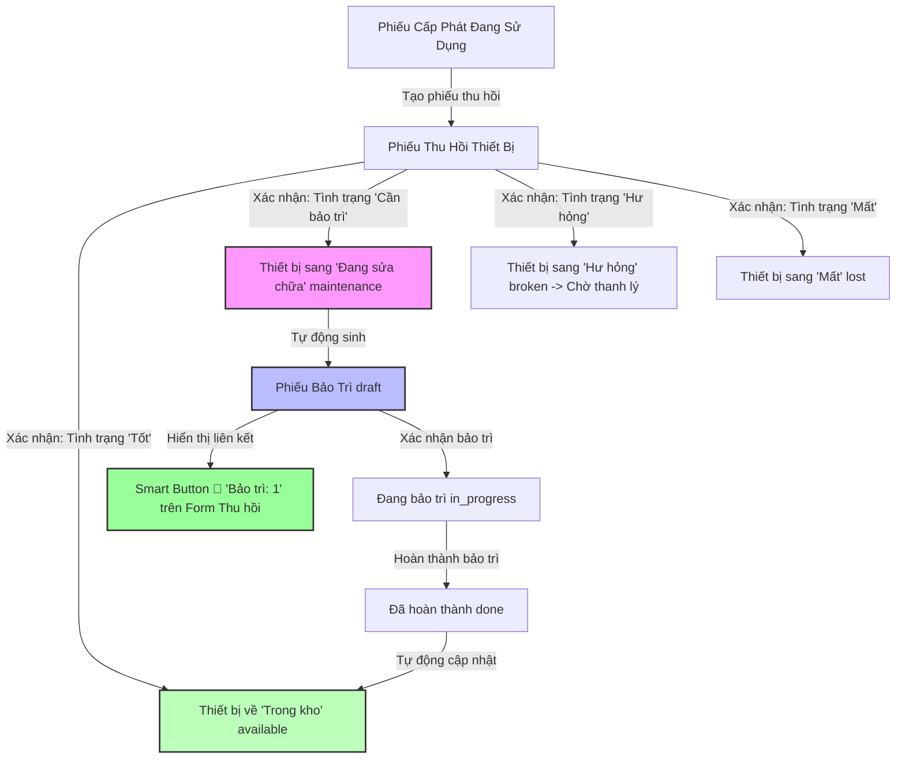

# 📘 BÁO CÁO TỔNG KẾT GIAI ĐOẠN 3: TỰ ĐỘNG HÓA NGHIỆP VỤ & AUDIT TRAIL CHATTER (P1)

> **Module**: `equipment_management` (Odoo 19.0)  
> **Nhánh thực hiện**: `feature/phase3-automation-chatter`  
> **Mục tiêu cốt lõi**: Tự động hóa luồng nghiệp vụ liên thông (**Thu hồi ➔ Bảo trì**), tích hợp **Smart Button điều hướng 1-click**, và kích hoạt hệ thống **Chatter / Audit Trail (Nhật ký theo dõi)** chuẩn Enterprise cho toàn bộ 5 models.

---

## 🎯 1. Kiến Trúc Tự Động Hóa & Luồng Nghiệp Vụ (Automation Architecture)

Sơ đồ quy trình tự động hóa và phân luồng trạng thái khi thu hồi thiết bị:



---

## 🛠️ 2. Chi Tiết Các Tính Năng Đã Triển Khai

### 2.1. Tự Động Sinh Phiếu Bảo Trì từ Phiếu Thu Hồi (`models/equipment_return.py` & `equipment_maintenance.py`)
* **Liên kết dữ liệu 2 chiều (Relational Link)**:
  - `company.equipment.return`: Bổ sung trường `maintenance_ids` (`One2many`) và `maintenance_count` (`Integer` compute).
  - `company.equipment.maintenance`: Bổ sung trường `return_id` (`Many2one`) liên kết trực tiếp về phiếu thu hồi nguồn.
* **Quy tắc phân loại tình trạng khi thu hồi (`condition`)**:
  - `good` (Tốt): Thiết bị lập tức được đưa về trạng thái **Trong kho (`available`)** để sẵn sàng bàn giao cho nhân viên tiếp theo.
  - `maintenance` (Cần bảo trì): Thiết bị chuyển sang **Đang sửa chữa (`maintenance`)**, đồng thời hệ thống **tự động tạo 1 Phiếu Bảo Trì** ở trạng thái Nháp (`draft`), sao chép toàn bộ mô tả lỗi và ngày yêu cầu.
  - `broken` (Hư hỏng): Thiết bị chuyển sang **Hư hỏng (`broken`)** phục vụ cho luồng thanh lý bán xác tài sản hư hại nặng không thể sửa chữa.
  - `lost` (Mất): Thiết bị chuyển sang **Mất (`lost`)** để ghi nhận tổn thất tài sản.
* **Smart Button Điều Hướng 1-Click (`views/return_views.xml`)**:
  - Tích hợp nút thông minh `fa-wrench` tại góc phải trên Form Thu hồi, hiển thị số lượng phiếu bảo trì (`maintenance_count`).
  - Khi bấm vào nút, hệ thống sẽ mở trực tiếp Form Phiếu bảo trì tương ứng để nhân viên kỹ thuật xử lý ngay lập tức.

---

### 2.2. Tích Hợp Hệ Thống Nhật Ký & Trao Đổi (Audit Trail Chatter)
* **Khai báo Module phụ thuộc (`__manifest__.py`)**: Bổ sung `"mail"` vào danh sách `"depends"`.
* **Kế thừa Mail Mixins trên cả 5 models**:
  ```python
  _inherit = ['mail.thread', 'mail.activity.mixin']
  ```
* **Kích hoạt trường theo dõi lịch sử (`tracking=True`)**:
  - `models/equipment.py`: `name`, `code`, `serial_number`, `category`, `purchase_price`, `state`, `employee_id`.
  - `models/allocation.py`: `name`, `equipment_id`, `employee_id`, `date`, `state`.
  - `models/equipment_return.py`: `name`, `allocation_id`, `date`, `condition`, `state`.
  - `models/equipment_maintenance.py`: `name`, `equipment_id`, `vendor_id`, `request_date`, `completion_date`, `cost`, `state`.
  - `models/equipment_liquidation.py`: `name`, `equipment_id`, `price`, `date`, `purchaser_name`, `state`.
* **Cập nhật Giao diện XML Views (`views/*.xml`)**:
  - Tích hợp component chuẩn Odoo 19: `<chatter/>` vào chân trang của toàn bộ 5 Form views.
  - Hỗ trợ đầy đủ các tính năng: Gửi tin nhắn (`Send message`), Ghi chú nội bộ (`Log note`), Lên lịch hoạt động (`Activity Schedule`), Tag tên nhân viên (`@`) và xem Lịch sử biến động trường dữ liệu (Audit logs).

---

### 2.3. Tinh Chỉnh Cơ Chế Bảo Vệ Dữ Liệu (`models/equipment_maintenance.py`)
* **Khóa linh hoạt theo vòng đời (`write`)**:
  - Trong lúc đang bảo trì (`in_progress`), cho phép kỹ thuật viên cập nhật chi phí sửa chữa (`cost`), đơn vị sửa chữa (`vendor_id`) và ngày hoàn thành (`completion_date`).
  - Khóa tuyệt đối việc đổi thiết bị (`equipment_id`) hoặc ngày yêu cầu (`request_date`) khi phiếu đã duyệt.
  - Khóa toàn bộ chứng từ khi phiếu đã ở trạng thái Hoàn thành (`done`) hoặc Đã hủy (`cancelled`).

---

## 🧪 3. Kiểm Thử Tự Động (Automated Unit Tests)

Bộ test tự động `tests/test_phase3_automation_chatter.py` được xây dựng gồm 5 test cases chi tiết:
1. `test_01_auto_create_maintenance_on_return`: Kiểm tra tự động tạo phiếu bảo trì khi thu hồi máy hỏng.
2. `test_02_no_maintenance_on_good_return`: Kiểm tra không tạo bảo trì khi máy thu hồi ở tình trạng tốt.
3. `test_03_smart_button_action`: Kiểm tra hàm điều hướng Smart Button trả về đúng view và res_id.
4. `test_04_maintenance_full_lifecycle_from_return`: Kiểm tra toàn bộ vòng đời bảo trì (Tạo tự động -> Xác nhận sửa -> Nhập chi phí -> Hoàn tất -> Trả thiết bị về Trong kho).
5. `test_05_mail_chatter_models_inherited`: Kiểm tra cả 5 model đều kế thừa thành công `mail.thread` và `mail.activity.mixin`.

### 📊 Kết Quả Chạy Toàn Bộ Test Suite (`--test-tags=equipment_all`):
```powershell
.\.venv\Scripts\python.exe odoo-bin -c odoo.conf -d odoo19 -u equipment_management --test-tags=equipment_all --stop-after-init
```
```text
10 post-tests in 0.72s, 568 queries
0 failed, 0 error(s) of 10 tests when loading database 'odoo19'
```

---

## 📋 4. Bảng Danh Mục File Đã Thay Đổi / Tạo Mới

| STT | Tên File | Loại thay đổi | Mô tả chi tiết |
| :---: | :--- | :---: | :--- |
| 1 | `__manifest__.py` | **Cập nhật** | Thêm `"mail"` vào danh sách `"depends"`. |
| 2 | `models/equipment_return.py` | **Cập nhật** | Thêm `maintenance_ids`, `maintenance_count`, `action_view_maintenance`, tự động tạo bảo trì trong `action_confirm`, kế thừa mail & tracking. |
| 3 | `models/equipment_maintenance.py` | **Cập nhật** | Thêm `return_id`, kế thừa mail & tracking, tinh chỉnh hàm `write()` bảo vệ. |
| 4 | `models/equipment.py` | **Cập nhật** | Kế thừa `mail.thread`, `mail.activity.mixin`, thêm `tracking=True`. |
| 5 | `models/allocation.py` | **Cập nhật** | Kế thừa `mail.thread`, `mail.activity.mixin`, thêm `tracking=True`. |
| 6 | `models/equipment_liquidation.py` | **Cập nhật** | Kế thừa `mail.thread`, `mail.activity.mixin`, thêm `tracking=True`. |
| 7 | `views/return_views.xml` | **Cập nhật** | Thêm Smart Button `action_view_maintenance` và component `<chatter/>`. |
| 8 | `views/maintenance_views.xml` | **Cập nhật** | Thêm trường `return_id` và component `<chatter/>`. |
| 9 | `views/equipment_views.xml` | **Cập nhật** | Thêm component `<chatter/>`. |
| 10 | `views/allocation_views.xml` | **Cập nhật** | Thêm component `<chatter/>`. |
| 11 | `views/liquidation_views.xml` | **Cập nhật** | Thêm component `<chatter/>`. |
| 12 | `tests/test_phase3_automation_chatter.py` | **Tạo mới** | Bộ kiểm thử tự động 5 test cases cho Phase 3. |
| 13 | `tests/__init__.py` | **Cập nhật** | Import `test_phase3_automation_chatter`. |
| 14 | `TASKS.md` | **Cập nhật** | Đánh dấu hoàn thành toàn bộ checklist Phase 3. |
| 15 | `PHASE_3_SUMMARY.md` | **Tạo mới** | Báo cáo chi tiết tổng kết Giai đoạn 3. |
