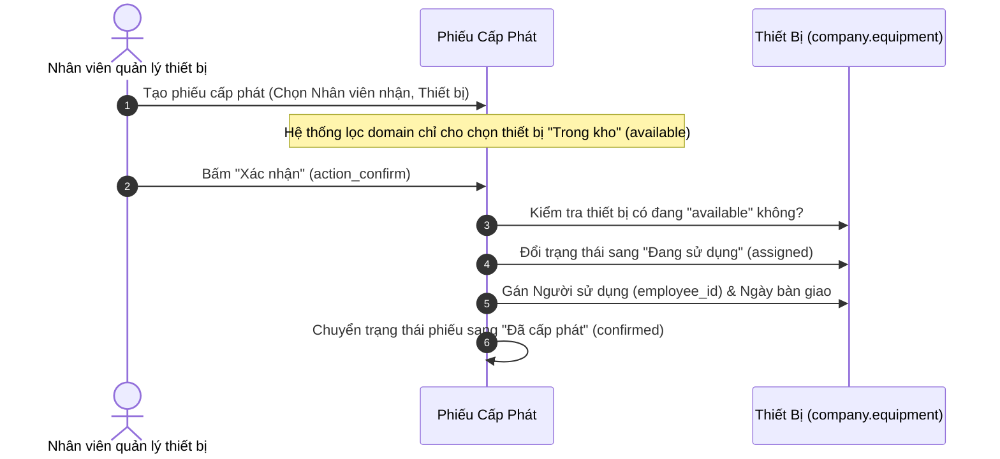
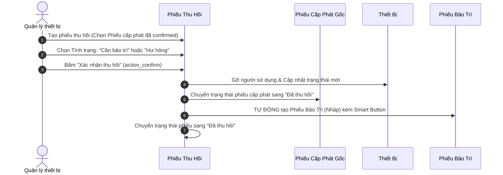
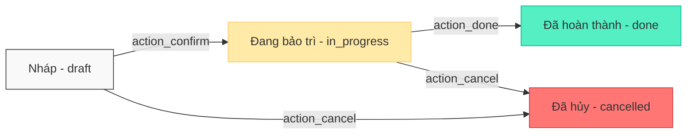

# 🏢 Module Quản Lý Thiết Bị Doanh Nghiệp (Equipment Management)

[](https://www.odoo.com)
[-success.svg)](https://github.com/ShibaDeku99/odoo-company-equipment)
[](https://github.com/ShibaDeku99/odoo-company-equipment)
[](https://www.gnu.org/licenses/lgpl-3.0.html)

> **Hệ thống Quản lý Vòng đời, Cấp phát, Thu hồi, Bảo trì, Khấu hao & Thanh lý Thiết bị Doanh nghiệp chuẩn Enterprise trên nền tảng Odoo 19.**

---

## 📑 Mục Lục

1. [Tính Năng Nổi Bật](#-tính-năng-nổi-bật)
2. [Cấu Trúc Dữ Liệu & Vòng Đời Thiết Bị](#-cấu-trúc-dữ-liệu--vòng-đời-thiết-bị)
3. [Quy Trình & Luồng Hoạt Động (Workflows)](#-quy-trình--luồng-hoạt-động-workflows)
   - [1. Quản lý Hồ sơ & Khấu hao thiết bị](#1-quản-lý-hồ-sơ--khấu-hao-thiết-bị)
   - [2. Quy trình Cấp phát thiết bị](#2-quy-trình-cấp-phát-thiết-bị)
   - [3. Quy trình Thu hồi thiết bị & Tự động hóa](#3-quy-trình-thu-hồi-thiết-bị--tự-động-hóa)
   - [4. Quy trình Bảo trì & Sửa chữa](#4-quy-trình-bảo-trì--sửa-chữa)
   - [5. Quy trình Thanh lý tài sản](#5-quy-trình-thanh-lý-tài-sản)
4. [Tích Hợp Chatter & Audit Trail](#-tích-hợp-chatter--audit-trail)
5. [Hệ Thống Phân Quyền & Bảo Mật](#-hệ-thống-phân-quyền--bảo-mật)
6. [Hướng Dẫn Cài Đặt & Chạy Kiểm Thử Tự Động](#-hướng-dẫn-cài-đặt--chạy-kiểm-thử-tự-động)

---

## ⭐ Tính Năng Nổi Bật

* **Khóa Chặt Vòng Đời ở Backend**: Ngăn chặn 100% các hành vi thao tác sai logic, bảo vệ chứng từ gốc khi đã xác nhận.
* **Tự Động Hóa Nghiệp Vụ**: Khi thu hồi thiết bị báo hỏng (`broken` / `maintenance`), hệ thống tự động sinh phiếu Bảo trì ở trạng thái Nháp kèm liên kết Smart Button.
* **Toàn Vẹn Dữ Liệu & Khấu Hao**: Ràng buộc duy nhất Mã thiết bị (`models.Constraint`), Số serial (`@api.constrains`), tính toán khấu hao đường thẳng tự động.
* **Chuẩn Tiền Tệ & Đa Công Ty**: Áp dụng `fields.Monetary` theo đơn vị tiền tệ công ty (VND) và cách ly dữ liệu Multi-Company độc lập.
* **Audit Trail & Chatter**: Kế thừa `mail.thread` và `mail.activity.mixin`, theo dõi biến động trạng thái (`tracking=True`) trên mọi mô hình.
* **Bộ Test Tự Động 100%**: 20 kịch bản kiểm thử tự động toàn diện bao phủ toàn bộ vòng đời và phân quyền.

---

## 🔄 Cấu Trúc Dữ Liệu & Vòng Đời Thiết Bị

Thiết bị (`company.equipment`) trải qua các trạng thái xuyên suốt vòng đời:

```mermaid
flowchart TD
    Start([⚡ Tạo mới]) --> Avail["📦 TRONG KHO (available)"]

    subgraph Operation [" VẬN HÀNH & SỬ DỤNG "]
        Avail -->|1. Cấp phát| Assign["👤 ĐANG SỬ DỤNG (assigned)"]
        Assign -->|Thu hồi: Tốt| Avail
    end

    subgraph Incident [" SỰ CỐ & BẢO TRÌ "]
        Avail -->|Gửi bảo trì| Maint["🔧 ĐANG SỬA CHỮA (maintenance)"]
        Assign -->|Thu hồi: Cần bảo dưỡng / Hỏng (Tự động sinh phiếu)| Maint
        Maint -->|Bảo dưỡng xong| Avail
        Assign -->|Thu hồi: Báo hỏng| Broken["⚠️ HƯ HỎNG (broken)"]
        Assign -->|Thu hồi: Báo mất| Lost["❌ MẤT (lost)"]
    end

    subgraph EndLife [" KẾT THÚC VÒNG ĐỜI "]
        Avail -->|Thanh lý kho| Liq["💰 ĐÃ THANH LÝ (liquidated)"]
        Maint -->|Không thể sửa| Liq
        Broken -->|Thanh lý xác| Liq
        Liq --> Finish([🏁 Kết thúc])
        Lost --> Finish
    end

    style Avail fill:#2ecc71,stroke:#27ae60,stroke-width:2px,color:#fff,font-weight:bold
    style Assign fill:#3498db,stroke:#2980b9,stroke-width:2px,color:#fff,font-weight:bold
    style Maint fill:#f39c12,stroke:#d35400,stroke-width:2px,color:#fff,font-weight:bold
    style Broken fill:#e67e22,stroke:#d35400,stroke-width:2px,color:#fff,font-weight:bold
    style Lost fill:#e74c3c,stroke:#c0392b,stroke-width:2px,color:#fff,font-weight:bold
    style Liq fill:#95a5a6,stroke:#7f8c8d,stroke-width:2px,color:#fff,font-weight:bold
    style Start fill:#f1c40f,stroke:#f39c12,stroke-width:2px,color:#333
    style Finish fill:#34495e,stroke:#2c3e50,stroke-width:2px,color:#fff
```

### Các trạng thái thiết bị (`state`):

| Mã trạng thái | Tên hiển thị            | Ý nghĩa                                                |
| :--------------- | :------------------------- | :------------------------------------------------------- |
| `available`    | **Trong kho**        | Thiết bị sẵn sàng để cấp phát cho nhân viên    |
| `assigned`     | **Đang sử dụng**  | Đang được giao cho một nhân sự phụ trách        |
| `maintenance`  | **Đang sửa chữa** | Đang gửi bảo trì/sửa chữa tại đơn vị cung cấp |
| `broken`       | **Hư hỏng**        | Thiết bị gặp lỗi, hỏng hóc chờ xử lý/thanh lý  |
| `liquidated`   | **Đã thanh lý**   | Đã bán thanh lý hoặc hủy bỏ tài sản             |
| `lost`         | **Mất**             | Bị thất lạc trong quá trình sử dụng               |

---

## 🚀 Quy Trình & Luồng Hoạt Động (Workflows)

### 1. Quản lý Hồ sơ & Khấu hao thiết bị

Hệ thống tự động tính toán giá trị tài sản dựa trên phương pháp đường thẳng:

- **Khấu hao mỗi năm** = $\frac{\text{Giá mua} - \text{Giá trị thu hồi dự kiến}}{\text{Thời gian khấu hao (năm)}}$
- **Tỷ lệ khấu hao/năm (%)** = $\frac{\text{Khấu hao mỗi năm}}{\text{Giá mua}} \times 100$
- **Khấu hao lũy kế** = $\text{Số năm đã sử dụng} \times \text{Khấu hao mỗi năm}$ (không vượt quá Nguyên giá - Giá trị thu hồi).
- **Giá trị còn lại** = $\max(\text{Giá mua} - \text{Khấu hao lũy kế}, \text{Giá trị thu hồi})$.

---

### 2. Quy trình Cấp phát thiết bị (`company.equipment.allocation`)



---

### 3. Quy trình Thu hồi thiết bị & Tự động hóa (`company.equipment.return`)



---

### 4. Quy trình Bảo trì & Sửa chữa (`company.equipment.maintenance`)



- **Tạo phiếu**: Chọn thiết bị trong kho/hư hỏng, đơn vị sửa chữa (`res.partner`), chi phí dự kiến.
- **Xác nhận (Bắt đầu sửa)**: Phiếu sang `in_progress`, thiết bị chuyển sang `maintenance` (Đang sửa chữa). Chống tạo phiếu bảo trì thứ 2 trùng lặp.
- **Hoàn thành**: Phiếu sang `done`, thiết bị chuyển trạng thái về `available` (Trong kho) để sẵn sàng cấp phát.
- **Hủy phiếu**: Nếu hủy trong khi đang sửa chữa, thiết bị tự động được hoàn trả về `available`.

---

### 5. Quy trình Thanh lý tài sản (`company.equipment.liquidation`)


---

## 💬 Tích Hợp Chatter & Audit Trail

Toàn bộ 5 mô hình đều được kế thừa:
* `mail.thread`: Ghi log tự động khi thay đổi trạng thái, gửi tin nhắn trao đổi nội bộ.
* `mail.activity.mixin`: Lên lịch hoạt động (Call, Meeting, To-do) nhắc nhở việc bảo trì hoặc thu hồi.
* `tracking=True`: Theo dõi nhật ký lịch sử các trường trọng yếu (`state`, `employee_id`, `cost`, `price`, `vendor_id`).

---

## 🔒 Hệ Thống Phân Quyền & Bảo Mật

Áp dụng cơ chế bảo mật 3 lớp chặt chẽ: **User Groups (RBAC)**, **Access Control Lists (ACL)**, và **Record Rules (Quy tắc bản ghi)**:

### Bảng phân quyền ma trận

| Nghiệp vụ | Nhân viên thông thường (`base.group_user`) | Nhân viên Quản lý Thiết bị (`group_equipment_user`) | Trưởng phòng / Quản lý (`group_equipment_manager`) |
| :--- | :---: | :---: | :---: |
| **Xem thiết bị của chính mình** | ✅ Có | ✅ Có | ✅ Có |
| **Xem toàn bộ thiết bị công ty** | ❌ Không | ✅ Có | ✅ Có |
| **Tạo, sửa, xóa Thiết bị** | ❌ Không | ✅ Toàn quyền | ✅ Toàn quyền |
| **Tạo & Xác nhận Cấp phát** | ❌ Không (chỉ xem của mình) | ✅ Toàn quyền | ✅ Toàn quyền |
| **Tạo & Xác nhận Thu hồi** | ❌ Không (chỉ xem của mình) | ✅ Toàn quyền | ✅ Toàn quyền |
| **Tạo & Thực hiện Bảo trì** | ❌ Không | ✅ Toàn quyền | ✅ Toàn quyền |
| **Xem Phiếu Thanh lý** | ❌ Không | ✅ Chỉ xem (Read-only) | ✅ Toàn quyền |
| **Phê duyệt Thanh lý** | ❌ Không | ❌ Không | ✅ **Toàn quyền phê duyệt** |
| **Cách ly Đa công ty (Multi-Company)** | ✅ Tự động | ✅ Tự động | ✅ Tự động |

---

## 🧪 Hướng Dẫn Cài Đặt & Chạy Kiểm Thử Tự Động

### 1. Cài đặt / Nâng cấp module
```powershell
.\.venv\Scripts\python.exe odoo-bin -c odoo.conf -d odoo19 -u equipment_management --stop-after-init
```

### 2. Chạy toàn bộ 20 bài Test tự động
```powershell
.\.venv\Scripts\python.exe odoo-bin -c odoo.conf -d odoo19 -u equipment_management --test-tags=equipment_all --stop-after-init
```

### 3. Chạy kiểm thử theo từng Giai đoạn:
* **Phase 1 (Backend Guards)**: `--test-tags=equipment_phase1`
* **Phase 2 (Constraints & Tiền tệ)**: `--test-tags=equipment_phase2`
* **Phase 3 (Automation & Chatter)**: `--test-tags=equipment_phase3`
* **Phase 4 (Security & Multi-Company)**: `--test-tags=equipment_security`
