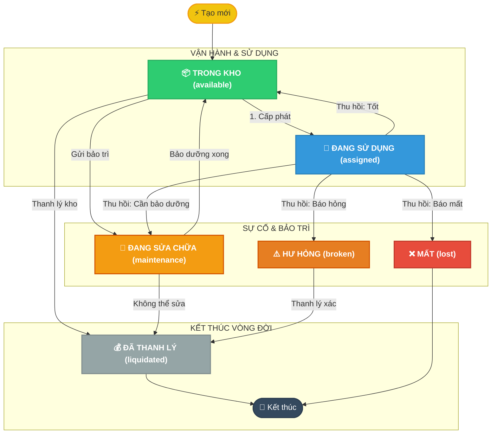
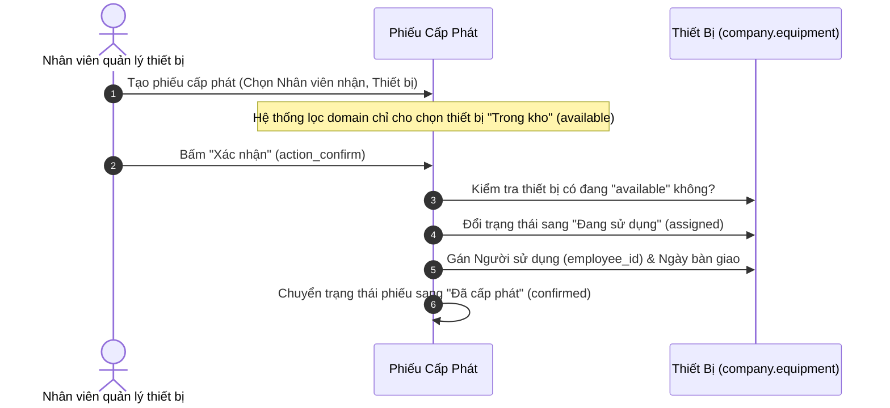
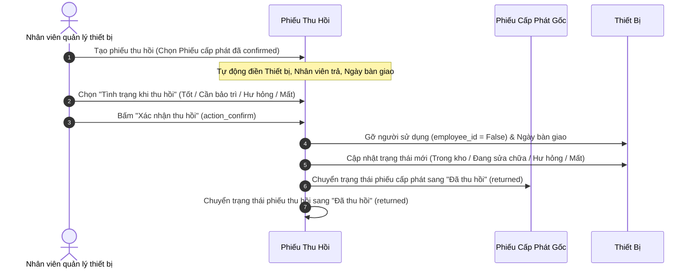
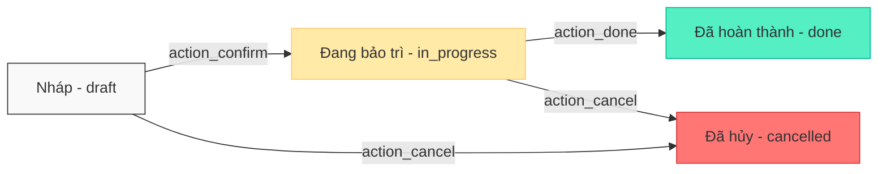
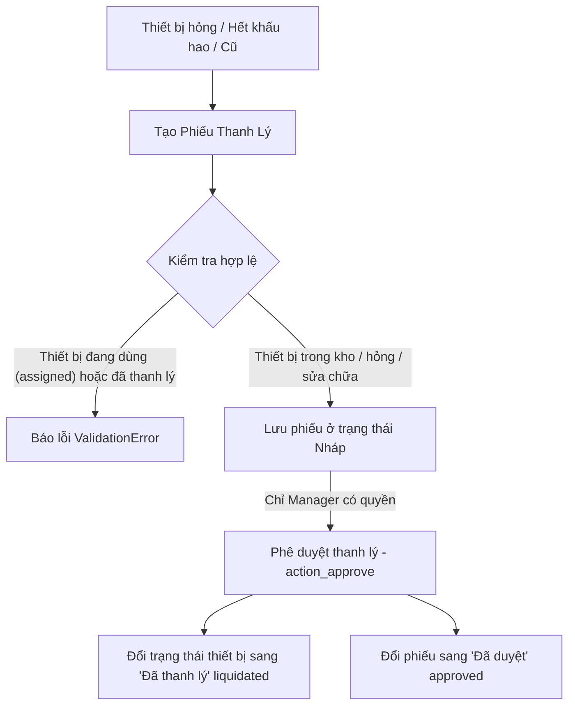

# 🏢 Module Quản Lý Thiết Bị Doanh Nghiệp (Equipment Management)

> **Module Odoo 19.0** - Giải pháp quản lý toàn diện vòng đời trang thiết bị tài sản trong doanh nghiệp (laptop, máy tính, thiết bị ngoại vi, văn phòng phẩm...), từ lúc mua sắm, cấp phát cho nhân viên, bảo dưỡng định kỳ đến thanh lý thu hồi vốn.

---

## 📑 Mục Lục
1. [Tính Năng Nổi Bật](#-tính-năng-nổi-bật)
2. [Cấu Trúc Dữ Liệu & Vòng Đời Thiết Bị](#-cấu-trúc-dữ-liệu--vòng-đời-thiết-bị)
3. [Quy Trình & Luồng Hoạt Động (Workflows)](#-quy-trình--luồng-hoạt-động-workflows)
   - [1. Quản lý Hồ sơ & Khấu hao thiết bị](#1-quản-lý-hồ-sơ--khấu-hao-thiết-bị)
   - [2. Quy trình Cấp phát thiết bị](#2-quy-trình-cấp-phát-thiết-bị)
   - [3. Quy trình Thu hồi thiết bị](#3-quy-trình-thu-hồi-thiết-bị)
   - [4. Quy trình Bảo trì & Sửa chữa](#4-quy-trình-bảo-trì--sửa-chữa)
   - [5. Quy trình Thanh lý tài sản](#5-quy-trình-thanh-lý-tài-sản)
4. [Hệ Thống Phân Quyền & Bảo Mật](#-hệ-thống-phân-quyền--bảo-mật)
5. [Tổng Kết Đóng Góp & Kỹ Năng Đã Thực Hiện (Báo Cáo Thực Tập)](#-tổng-kết-đóng-góp--kỹ-năng-đã-thực-hiện-báo-cáo-thực-tập)

---

## 🌟 Tính Năng Nổi Bật

- 💻 **Quản lý thông tin chi tiết**: Tên, mã định danh, số serial, chủng loại, ngày mua, nguyên giá.
- 📉 **Tính khấu hao tự động**: Tự động tính tỷ lệ khấu hao hàng năm, khấu hao lũy kế theo thời gian thực và giá trị còn lại của thiết bị.
- 🤝 **Cấp phát & Thu hồi chính xác**: Gắn liền với nhân viên (`hr.employee`), kiểm tra ràng buộc chống cấp phát trùng lặp hay thu hồi sai trạng thái.
- 🛠️ **Nhật ký bảo trì minh bạch**: Theo dõi đơn vị sửa chữa (`res.partner`), chi phí, nguyên nhân và tiến độ khắc phục sự cố.
- 💰 **Kiểm soát thanh lý nghiêm ngặt**: Chỉ cho phép cấp quản lý phê duyệt thanh lý các thiết bị cũ, hỏng hoặc hết khấu hao.

---

## 🔄 Cấu Trúc Dữ Liệu & Vòng Đời Thiết Bị

Thiết bị (`company.equipment`) trải qua các trạng thái xuyên suốt vòng đời:

### Các trạng thái thiết bị (`state`):
| Mã trạng thái | Tên hiển thị | Ý nghĩa |
| :--- | :--- | :--- |
| `available` | **Trong kho** | Thiết bị sẵn sàng để cấp phát cho nhân viên |
| `assigned` | **Đang sử dụng** | Đang được giao cho một nhân sự phụ trách |
| `maintenance` | **Đang sửa chữa** | Đang gửi bảo trì/sửa chữa tại đơn vị cung cấp |
| `broken` | **Hư hỏng** | Thiết bị gặp lỗi, hỏng hóc chờ xử lý/thanh lý |
| `liquidated` | **Đã thanh lý** | Đã bán thanh lý hoặc hủy bỏ tài sản |
| `lost` | **Mất** | Bị thất lạc trong quá trình sử dụng |

---

## 🚀 Quy Trình & Luồng Hoạt Động (Workflows)

### 1. Quản lý Hồ sơ & Khấu hao thiết bị
Hệ thống tự động tính toán giá trị tài sản dựa trên phương pháp đường thẳng:
- **Khấu hao mỗi năm** = $\frac{\text{Giá mua} - \text{Giá trị thu hồi dự kiến}}{\text{Thời gian khấu hao (năm)}}$
- **Tỷ lệ khấu hao/năm (%)** = $\frac{\text{Khấu hao mỗi năm}}{\text{Giá mua}} \times 100$
- **Khấu hao lũy kế** = $\text{Số năm đã sử dụng} \times \text{Khấu hao mỗi năm}$ (không vượt quá Nguyên giá - Giá trị thu hồi).
- **Giá trị còn lại** = $\max(\text{Giá mua} - \text{Khấu hao lũy kế}, \text{Giá trị thu hồi})$.

---

### 2. Quy trình Cấp phát thiết bị (`company.equipment.allocation`)

---

### 3. Quy trình Thu hồi thiết bị (`company.equipment.return`)

> [!NOTE]
> **Ràng buộc an toàn:**
> - Ngày thu hồi không được nhỏ hơn ngày cấp phát.
> - Mỗi phiếu cấp phát chỉ được thu hồi duy nhất 1 lần (chống thu hồi trùng).
> - Phiếu thu hồi đã hoàn thành không thể bị xóa để đảm bảo toàn vẹn dữ liệu kế toán/tài sản.

---

### 4. Quy trình Bảo trì & Sửa chữa (`company.equipment.maintenance`)

- **Tạo phiếu**: Điền thiết bị, đơn vị sửa chữa (`res.partner`), chi phí dự kiến, mô tả hỏng hóc.
- **Xác nhận (Bắt đầu sửa)**: Trạng thái phiếu sang `in_progress`, thiết bị chuyển sang `maintenance` (Đang sửa chữa).
- **Hoàn thành**: Trạng thái phiếu sang `done`, tự động lưu ngày hoàn tất, thiết bị chuyển trạng thái về `available` (Trong kho) để sẵn sàng cấp phát tiếp.
- **Hủy phiếu**: Nếu hủy trong khi đang sửa chữa, thiết bị tự động được hoàn trả về trạng thái `available`.

---

### 5. Quy trình Thanh lý tài sản (`company.equipment.liquidation`)

---

## 🔒 Hệ Thống Phân Quyền & Bảo Mật

Module áp dụng cơ chế bảo mật 3 lớp chặt chẽ của Odoo: **User Groups (Nhóm người dùng)**, **Access Control Lists (ACL)**, và **Record Rules (Quy tắc bản ghi)**:

### 1. Bảng phân quyền tổng hợp

| Đối tượng / Nghiệp vụ | Nhân viên thông thường (`base.group_user`) | Nhân viên Quản lý Thiết bị (`group_equipment_user`) | Trưởng phòng / Quản lý (`group_equipment_manager`) |
| :--- | :---: | :---: | :---: |
| **Xem thiết bị của bản thân** | ✅ Xem | ✅ Xem | ✅ Xem |
| **Xem toàn bộ thiết bị công ty** | ❌ Không | ✅ Xem | ✅ Xem |
| **Tạo, sửa, xóa Thiết bị** | ❌ Không | ✅ Toàn quyền | ✅ Toàn quyền |
| **Tạo & Duyệt Phiếu Cấp phát** | ❌ Không (chỉ xem phiếu của mình) | ✅ Toàn quyền | ✅ Toàn quyền |
| **Tạo & Duyệt Phiếu Thu hồi** | ❌ Không (chỉ xem phiếu của mình) | ✅ Toàn quyền | ✅ Toàn quyền |
| **Tạo & Thực hiện Bảo trì** | ❌ Không | ✅ Toàn quyền | ✅ Toàn quyền |
| **Xem Phiếu Thanh lý** | ❌ Không | ✅ Chỉ xem (Read-only) | ✅ Toàn quyền |
| **Tạo & Phê duyệt Thanh lý** | ❌ Không | ❌ Không | ✅ **Toàn quyền phê duyệt** |

---

### 2. Chi tiết phân cấp quyền:

#### 👤 **Nhân viên thông thường (`base.group_user`)**
- Chỉ thấy được thiết bị và phiếu cấp phát/thu hồi được giao cho chính tài khoản của mình (`employee_id.user_id == user.id`).
- Không thấy menu quản lý nâng cao, không sửa/xóa được dữ liệu.

#### 👷 **Nhân viên Quản lý Thiết bị (`group_equipment_user`)**
- Xem và quản lý toàn bộ thiết bị trong công ty.
- Thực hiện toàn bộ quy trình vận hành hàng ngày: Cấp phát, Thu hồi, Gửi bảo dưỡng thiết bị.
- Đối với thanh lý: Chỉ được xem lịch sử thanh lý, không được duyệt thanh lý tài sản.

#### 👑 **Quản lý Thiết bị (`group_equipment_manager`)**
- Kế thừa toàn bộ quyền của Nhân viên Quản lý Thiết bị.
- Nắm giữ thẩm quyền cao nhất: Phê duyệt các phiếu Thanh lý thiết bị (`company.equipment.liquidation`), định giá bán và ghi nhận bên mua.
- Hiển thị menu chuyên biệt **"Thanh lý"**.

---

## 🎓 Tổng Kết Đóng Góp & Kỹ Năng Đã Thực Hiện (Báo Cáo Thực Tập)

Tóm tắt toàn bộ khối lượng công việc, kiến thức chuyên môn và kỹ năng thực tế đã nghiên cứu và triển khai hoàn thiện trong module **Equipment Management**:

### 1. Các hạng mục công việc đã hoàn thành (Deliverables)
- **Thiết kế Kiến trúc Cơ sở dữ liệu (Database & ORM Modeling)**:
  - Xây dựng 5 models Odoo ORM hoàn chỉnh: `company.equipment`, `company.equipment.allocation`, `company.equipment.return`, `company.equipment.maintenance`, `company.equipment.liquidation`.
  - Thiết lập các mối quan hệ liên kết dữ liệu phức tạp (`Many2one`, `One2many`, `Related fields` có `store=True` để tối ưu truy vấn).
- **Phát triển Logic Nghiệp vụ Nâng cao (Business Logic & Backend Development)**:
  - **Tự động sinh mã chứng từ**: Tích hợp `ir.sequence` sinh mã tự động theo mẫu chuẩn (`ALLOC/YYYY/XXXX`, `RET/YYYY/XXXX`, `MAINT/YYYY/XXXX`, `LIQ/YYYY/XXXX`).
  - **Công thức tính khấu hao thời gian thực**: Sử dụng `@api.depends` để tính toán chính xác khấu hao hàng năm, tỷ lệ khấu hao, khấu hao lũy kế theo số ngày thực tế và giá trị còn lại.
  - **Xử lý ràng buộc & Bắt lỗi nghiệp vụ**: Áp dụng `@api.constrains` để kiểm tra tính hợp lệ về mặt thời gian (ngày thu hồi $\ge$ ngày cấp phát), chống trùng lặp dữ liệu (chống thu hồi 2 lần cho 1 phiếu cấp phát) và validate trạng thái thiết bị trước khi thực hiện hành động.
  - **Bảo toàn tính toàn vẹn dữ liệu**: Override phương thức `unlink()` ngăn chặn người dùng vô tình xóa các chứng từ đã hoàn thành hoặc đã phê duyệt.
- **Xây dựng Giao diện Người dùng (UI/UX XML Views)**:
  - Tổ chức cấu trúc Menu đa cấp chuyên nghiệp, điều hướng thuận tiện cho từng phân hệ.
  - Thiết kế Tree views trực quan với các màu sắc trạng thái (badge decoration), Form views chuẩn Odoo với statusbar header và các nút hành động (smart buttons).
  - Tích hợp Search views, bộ lọc Filter (Trong kho, Đang sử dụng, Cần bảo dưỡng,...) và Group By theo phân loại, trạng thái, nhân viên.
- **Triển khai Hệ thống Phân quyền & Bảo mật (Security & Access Control)**:
  - Xây dựng Module Category, Privilege và 2 nhóm quyền riêng biệt (`group_equipment_user`, `group_equipment_manager`) kế thừa nhóm `base.group_user`.
  - Thiết lập bảng phân quyền truy cập chi tiết (`ir.model.access.csv`).
  - Cấu hình Record Rules (`ir.rule`) thông minh: Giới hạn nhân viên chỉ xem được thiết bị và phiếu của chính mình (`[('employee_id.user_id', '=', user.id)]`), trong khi cấp quản lý có thể xem toàn bộ hệ thống.

---

### 2. Kiến thức & Kỹ năng Thu Nhận Được (Key Competencies & Technical Skills)
- **Nền tảng Odoo Framework**: Thành thạo cấu trúc module Odoo 19.0, cơ chế kế thừa, ORM Methods (`create`, `write`, `unlink`, `search`), Decorators (`@api.depends`, `@api.constrains`, `@api.model_create_multi`).
- **Tư duy Nghiệp vụ Doanh nghiệp (ERP Business Process)**: Hiểu sâu sắc cách thức vận hành luồng quản lý tài sản, khấu hao và điều phối thiết bị trong môi trường doanh nghiệp thực tế.
- **Bảo mật & Quản trị dữ liệu**: Nắm vững cơ chế bảo mật đa tầng của Odoo (Groups -> Implied Groups -> ACL Matrix -> Record Rules Domain).
- **Quy chuẩn lập trình & Quản lý Source Code**: Tuân thủ chuẩn coding convention của Odoo, quản lý phiên bản với Git và trình bày tài liệu kỹ thuật rõ ràng, chi tiết.
